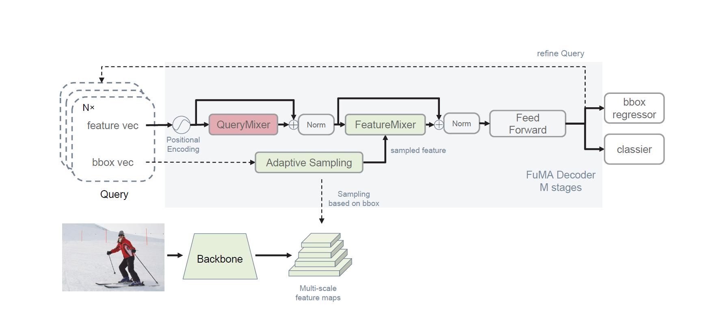

## FuMA: A Fully MLP Decoder Architecture for Query-Based Object Detection



FuMA has a fully multi-layer perceptron decoder query-based architecture. For more details, please refer to our paper.


## Quick Start

Our code is implemented using the MMDetection framework. For more details on how to use the code, please refer to the mmdetection documentation available at [get_started.md](https://github.com/lombenick/FuMA/blob/main/docs/get_started.md).

#### Installation

**Step 0.** Ensure you have PyTorch ≥ 1.5 installed and [torchvision](https://github.com/pytorch/vision/) that corresponds to the PyTorch installation. Additionally, make sure you have [mmcv-full](https://mmcv.readthedocs.io/en/latest/get_started/installation.html) version ≥ 1.3.3 and < 1.4.0 installed. 

**Step 1.** Git clone this repository.

```bash
git clone https://github.com/lonebenic/FuMA.git
cd FuMA
```

**Step 2.** Install requirements.

```bash
pip install -r requirements.txt
```

**Step 3.** Install FuMA(gpu required).

```bash
python setup.py develop
```

#### Data preparation

- You need to download the MS COCO 2017 dataset from its [official website](https://cocodataset.org/#download).
- The directory will be as follows:

```bash
mmdetection
├── mmdet
├── tools
├── configs
├── data
│   ├── coco
│   │   ├── annotations
│   │   ├── train2017
│   │   ├── val2017
│   │   ├── test2017
```

#### Tutorials

##### **Train.**

We have provided a Makefile for training FuMA efficiently. For example, to run FuMA using ResNet-50 with 1x training schedule, simply use the following command:

```makefile
make fuma-r50-1x
```

For more details, please refer to the Makefile available at [get_started.md](https://github.com/lombenick/FuMA/blob/main/Makefile).

## Main Results

|                            config                            |                      augmentation                       | Lr schd |  backbone  |  AP  | APs  | Gflops |                             log                              |
| :----------------------------------------------------------: | :-----------------------------------------------------: | :-----: | :--------: | :--: | :--: | :----: | :----------------------------------------------------------: |
|          [config](configs/fuma/fuma_r50_1x_coco.py)          |               random horizontal flipping                |   1x    | ResNet-50  | 42.6 | 25.2 |  104   | [log](logs/FuMA_logs/FuMA_r50_1x_coco/FuMA_r50_1x_coco.log)  |
| [config](configs/fuma/fuma_r50_300_query_crop_mstrain_480-800_3x_coco.py) | random horizontal flipping, random crop and multi-scale |   3x    | ResNet-50  | 46.7 | 28.8 |  119   | [log](logs/FuMA_logs/FuMA_r50_3x_coco/FuMA_r50_3x_coco.log)  |
|         [config](configs/fuma/fuma_r101_1x_coco.py)          |               random horizontal flipping                |   1x    | ResNet-101 | 43.5 | 25.4 |  184   | [log](logs/FuMA_logs/FuMA_r101_1x_coco/FuMA_r101_1x_coco.log) |
| [config](configs/fuma/fuma_r101_300_query_crop_mstrain_480-800_3x_coco.py) | random horizontal flipping, random crop and multi-scale |   3x    | ResNet-101 | 47.7 | 29.4 |  198   | [log](logs/FuMA_logs/FuMA_r101_3x_coco/FuMA_r101_3x_coco.log) |

**Note:** The data in the log file originates from the outcomes of a single 3090 GPU, and there could be a variance of up to 0.3 AP compared to the results presented in the paper.

## Exciting new information is coming soon!
